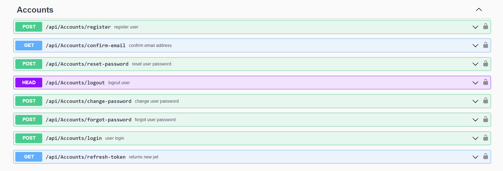

# Library Management REST API

The Library Management API is a robust solution designed to streamline the management of library resources. It provides a set of endpoints for seamless integration with various library management systems, facilitating efficient handling of books, patrons, and related data.

## Features

- **Book Management:** Easily add, update, and retrieve information about books in the library. Each book entry includes details such as title, authors, availability status.

- **Borrowing and Returning:** Manage the borrowing and returning process efficiently. Track the status of borrowed books, due dates, and late returns.

- **Borrowing and Returning History:** Store and retrieve users' borrowing, returning history, providing insights into past transactions and preferences.

- **Notifications:** Send notifications to users for reservation confirmations, due dates, and other relevant updates.

- **Search and Filters:** Conduct advanced searches for books based on different criteria, such as title, author, publication date. Apply filters to streamline the retrieval of specific information.

- **API Versioning:** Include versioning to manage updates and changes to the API without disrupting existing integrations.

- **User Authentication:** Ensure the security of the system with user authentication mechanisms. Only authorized users can access certain functionalities, preventing unauthorized access.

## Endpoints

- **Users Controller:**
The Users Controller manages application users.

- **Roles Controller:**
The Roles Controller manages user roles, allowing administrators to set permissions for different groups. It facilitates secure access control and interfaces with authentication systems for efficient user management in the application.

- **Accounts Controller:** The Accounts Controller in our application is responsible for handling user-related functionality. This includes user registration, login, and any other actions related to user accounts.  

- **Accounts Controller:** The Accounts Controller in our application is responsible for handling user-related functionality. This includes user registration, login, and any other actions related to user accounts.  

- **Profiles Controller:** The Profiles Controller, integrated with a Borrowing History feature, manages user profiles and stores their borrowing history within the library application.

- **Items Controller:** The Items Controller manages a specific type of borrowable item within the application. It allows administrators to handle operations such as adding, updating, or removing items, ensuring effective management of a particular category of borrowable resources.

- **Copies Controller:** The Copies Controller represents individual copies of borrowable items, managing their status and availability for lending. It facilitates operations such as adding, updating, and tracking specific copies, ensuring detailed control and organization of each item instance available for borrowing within the system.

- **Rentals Controller:** The Rentals Controller manages the representation of item rentals, overseeing operations such as creating, updating, and tracking specific instances of item loans. It plays a pivotal role in monitoring the borrowing status, due dates, and return processes for each rented item within the application.

- **Reservations Controller:** The Reservations Controller handles the representation and management of item reservations within the application. It facilitates operations such as creating, updating, and tracking reservations for specific items, ensuring a systematic approach to handling user requests and maintaining organized access to borrowable resources.

## Authentication

JWT Bearer token authentication provides a secure method for controlling access to API resources. Clients authenticate and obtain a token, which is then used to authorize requests to protected endpoints. The server validates the token to ensure secure and controlled access to different functionalities within the application.
